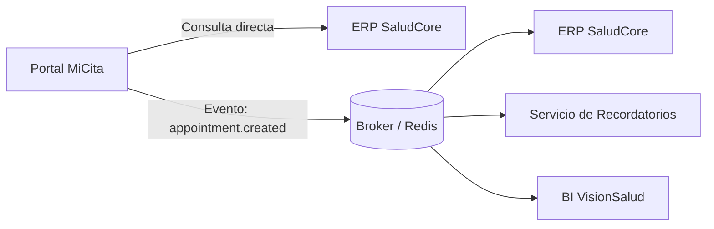

# Brief Ejecutivo-Tecnico - Clinica Santa Elena

## 1. Organizacion

La organizacion es una clinica privada orientada a consulta externa, gestion de citas, laboratorio y facturacion. El objetivo de la integracion es conectar el portal de pacientes con el ERP clinico sin acoplar todos los sistemas entre si.

## 2. Sistemas con nombres personalizados

- **Portal MiCita**: portal web donde el paciente agenda, reprograma o cancela citas.
- **ERP SaludCore**: system of record de la clinica; centraliza pacientes, agenda oficial, facturacion e historia administrativa.
- **LIS LabTrack**: sistema de laboratorio.
- **BI VisionSalud**: tablero de indicadores para gerencia.
- **Servicio de Recordatorios**: notificaciones por correo o WhatsApp.

En este repositorio:

- `producer` representa a **Portal MiCita**.
- `consumer` representa a un consumidor como **ERP SaludCore** u otro sistema interno.

## 3. Integracion recomendada

### Punto a punto para casos simples

Para consultas que necesitan respuesta inmediata y solo involucran al ERP, conviene una integracion directa `Portal MiCita -> ERP SaludCore`.

Casos simples:

- consultar disponibilidad de agenda
- validar si un paciente ya existe
- consultar estado de una factura
- revisar cobertura o autorizacion ya registrada

Motivo: son consultas directas al ERP y no justifican una arquitectura orientada a eventos.

### Event-driven para desacoplar

Cuando el portal genera una accion que puede interesar a varios sistemas, conviene publicar un evento y dejar que cada consumidor actue por separado.

Flujo propuesto:

1. **Portal MiCita** publica un evento.
2. **ERP SaludCore** consume el evento para registrar la cita.
3. **Servicio de Recordatorios** consume el mismo evento para enviar confirmaciones.
4. **BI VisionSalud** consume el evento para analitica operativa.
5. Otros sistemas, como **LabTrack**, pueden suscribirse despues sin cambiar el portal.

Eventos sugeridos:

- `appointment.created`
- `appointment.rescheduled`
- `appointment.cancelled`
- `patient.registered`

## 4. Ejemplo aplicado al proyecto

En la demo actual, el flujo principal es:

1. El paciente agenda una cita en **Portal MiCita**.
2. El portal publica `appointment.created`.
3. **ERP SaludCore** consume el evento y procesa la cita.

Esto permite que el portal no dependa de llamadas sincronas a cada sistema consumidor.

## 5. Resumen de criterio

- **Punto a punto** para casos simples y consultas directas al ERP.
- **Event-driven** para desacoplar procesos donde varios sistemas deben reaccionar al mismo hecho de negocio.

## 6. Gobierno de TI

Se propone un esquema minimo viable de gobierno de TI, alineado a COBIT, para asegurar control sobre datos clinicos, cambios, seguridad e integraciones.

### 6.1 Roles y responsabilidades

- **Direccion**: prioriza inversiones, acepta riesgos y define el nivel de criticidad del servicio.
- **TI (Arquitectura y Operaciones)**: define estandares, disponibilidad, integracion, observabilidad y continuidad operativa.
- **Seguridad**: define politicas, monitorea eventos, gestiona vulnerabilidades y coordina la respuesta a incidentes.
- **Dueno de Proceso (Clinica / Administracion)**: define reglas del negocio, datos criticos, flujos de aprobacion y criterios de calidad de la informacion.
- **Proveedor / SaaS**: cumple SLAs, brinda soporte, mantiene evidencias de cumplimiento y participa en incidentes que afecten el servicio.

### 6.2 Decisiones gobernadas

Las decisiones minimas que deben tener responsable, criterio y registro son:

1. **Fuente de verdad del paciente (Master Data)**: `ERP SaludCore` es la fuente oficial para identidad y registro administrativo del paciente.
2. **Gestion de cambios y releases en sistemas criticos**: todo cambio en `Portal MiCita`, integraciones o `ERP SaludCore` debe pasar por revision, aprobacion y plan de rollback.
3. **Accesos**: definicion de roles, MFA para usuarios privilegiados y segregacion de funciones entre operacion, soporte y administracion.
4. **Backups y restauracion**: definicion de RPO/RTO, respaldo cifrado y pruebas de restauracion sobre sistemas y datos criticos.
5. **Seleccion y gestion de proveedores**: evaluacion de SaaS e integradores con criterios de SLA, soporte, seguridad y cumplimiento.
6. **Estandares de integracion**: uso de APIs y eventos con contratos claros, versionado y politicas de compatibilidad.

### 6.3 Politicas minimas

- **Accesos e identidades**: MFA, RBAC y revisiones periodicas de usuarios, privilegios y cuentas de servicio.
- **Cambios y despliegues**: PRs, revision tecnica, ambientes separados, aprobacion antes de produccion y rollback documentado.
- **Backups y restauracion**: frecuencia definida por criticidad, cifrado de respaldos y pruebas mensuales de recuperacion.
- **Gestion de incidentes**: clasificacion por severidad, guardias, tiempos de escalamiento y comunicacion a responsables del negocio.
- **Proveedores / SaaS**: SLAs formales, auditorias, evaluacion de riesgo y seguimiento de incumplimientos.

### 6.4 Aplicacion al caso de la clinica

En este contexto:

- `ERP SaludCore` conserva la autoridad sobre datos maestros del paciente.
- `Portal MiCita` puede capturar solicitudes, pero no redefine la fuente oficial del dato clinico-administrativo.
- Los eventos como `appointment.created` deben publicarse con contrato versionado y validado.
- Cualquier cambio en el flujo de citas debe coordinarse entre TI, Seguridad y el dueno del proceso.
